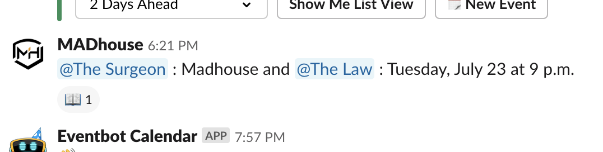

# New Player Quickstart Guide

This document covers everything a new FODLer needs to know ahead of their first season in the Future Olympians Dart  League. Our current tools-of-choice are:

- Discord (for video conferencing)
- DartConnect (for matchplay)
- Slack (for group chat and messaging)

## Account(s) Setup

1. **[DartConnect](https://members.dartconnect.com/signup#member)**
   Create a Premium ($24/year) account if you do not already have one. If you already have a free account you must upgrade to Premium before the start of the season.
2. **[Discord](https://discordapp.com/register)**
   Create a free account if you do not already have one. Then, download the Discord App for whichever device you will be using to provide your video feed.
3. **[Slack](https://www.slack.com)**
   The League Coordinator will reach out to invite you to the FODL Slack. You can use it in a web browser or download the app(s) for Mac, Windows, iOS, or Android.

Once your DartConnect and Discord accounts are created you need to email the following information to the League Coordinator:

- The email address for your DartConnect account
- Your Discord username (i.e. `myCoolNickname#1234`)

## Season Overview

Season standings, results, and schedules are available in the Google Sheet. In each Division's schedule tab you can find your weekly matchups. An asterisk beside a player's name indicates they have the darts in the match (we do not shoot for Bull). The Sheet is typically updated daily with the latest match results and Bonus Points for the week. Bonus Points are only added to the overall Division leaderboards once all matches have been played for that gameweek.

:warning: **Note:** The Google Sheet will not be available until a couple of weeks before the start of the season.

## Preseason Onboarding

### Add your division as Friends on Discord

Before your season begins it's important that you're Friends with each of the players in your division, as well as with the broadcast booth. Discord IDs are accessible in your season's Schedule tab in the Google Sheet. They are in the form of  `MyUsername#1234`. Use that full string when sending your Friend Requests.

### Set up Slack

When setting up your Slack profile be sure to set your Name as your full name, and your Display Name as your darts nickname.

The next thing you'll want to do is configure your Channel subscriptions.

**Standard Channels:**

- \#darts: Chat about darts gear, solicit people for scrimmage matches, wax philosophical about PDC announcements, and debate checkout strategies
- \#random: Off-topic discussion that often revolves around music, EPL, and cycling (during the Tour de France) 
- \#general: Different than darts and random in some way that I can't describe
- \#scheduling: One player from each match announces their match time for the week once it's been decided upon

**Other Channels:**

- \#spoilers: Live chat about PDC events and live sporting events (do not post spoilers in any other channel!)
- \#casting: Broadcsting-specific discussions such as caster schedules, hardware, and the Twitch platform
- \#dukes: Madison, James Madison, We are the Dukes of JMU
- Other channels are discoverable in your Slack application.

## Scheduling

Once you're ready to coordinate a day and time with your opponent you should send them a Direct Message on Slack. Post your match day and time in the `#scheduling` channel on Slack, being sure to mention your opponent and `@The Surgeon` so that everyone sees it. For example,

## Matchplay

### Match Setup

DartConnect is a web application you run from a browser like Safari, Chrome, or Silk. To access the scoreboard, either as the Home or Guest player, you must sign in to your account at [app.dartconnect.com](https://app.dartconnect.com) (not dartconnect.com).

If you are the Home player (player who has the darts) then it is your responsibility to configure the match. Refer to the [DartConnect video tutorial](https://photos.app.goo.gl/zSpDgZiby45rBAFN7) for instructions.

If you are the away play you will be provided a Connect Code by your opponent. Instructions for joining as a guest are covered in the match video above.

### Video Streaming

All FODL matches should be played on Discord, even if they are not being broadcast on Twitch. In order to minimize potential technical issues we recommend players take the following steps:

- Ensure your streaming device can handle the demands of a 45-minute Discord call without encountering any audio or video disruptions.
- If streaming from a phone, ensure that a power source is available or that your battery can last long enough.
- Ensure your Internet connection _on your device_ is delivering at _least_ 1Mbps Up and 3Mbps down (5-10Mbps up preferred).
- Your camera should provide as tight a shot of your board as possible, ideally capturing the area just above the "20" and below the "3" number indicators, and part of your surround.

### Twitch

There are some additional points of mention for matches being broadcast on Twitch.

- The broadcast booth will initiate all Discord calls for Twitch matches. Do not create a call with your opponent if you are being broadcast.
- Make sure you are signed on at least 5 minutes prior to your match start time.
- Do not run the Twitch stream on any of the devices you are using for matchplay.

## Troubleshooting

### Discord

- If your video stream is having issues, disable and then re-enable your camera in the Discord call. Do not leave and then re-join the call, as that will mess up the Discord view for your opponent and for the broadcast booth.
- Depending on your lighting environment, you may wish to install additional software for your video camera (if running on a computer) in order to adjust contrast, saturation, and color levels. It is strongly recommend that you test camera settings with a broadcaster ahead of your first match if you are unsure of your video quality.
- Sometimes Discord has connectivity problems. If you're having trouble connecting to a call you may want to restart Discord, or restart your computer, and then try to join again.
=======
If you are the Home player (player who has the darts) then it is your responsibility to configure the match. Refer to The Criminal's [DartConnect video tutorials](https://photos.app.goo.gl/zSpDgZiby45rBAFN7) for detailed instructions.

If you are the away player you will be provided a Connect Code by your opponent. Instructions for joining as a guest are covered in the match video above.

### Streaming

All FODL matches should be played on Discord, even if they are not being broadcast on Twitch. In order to minimize potential technical issues we recommend players take the following steps:

- Ensure your streaming device can handle the demands of a 45-minute Discord call without encountering any audio or video disruptions
- If streaming from a phone, ensure that a power source is available or that your battery can last long enough
- Ensure your Internet connection _on your device_ is delivering at _least_ 1Mbps Up and 3Mbps down (5-10Mbps up preferred)
